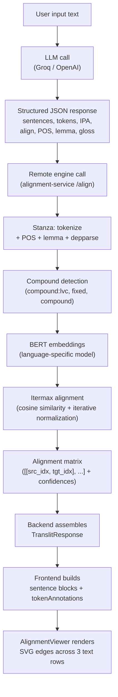

# Cross-Script Alignment System

Ett distribuerat NLP-system för att aligna text mellan olika skriftsystem, vilket möjliggör fonetisk mappning, translitterering och analys på token-nivå.

**Notera:** Detta repositorium är en strukturell snapshot för hiring visibility. Proprietära modeller, alignment-logik och heuristik har ersatts med stubbar.

---

## Systemarkitektur

Plattformen använder en flerstegs pipeline för alignment:

Klient (Next.js UI)  
↓  
API-lager (FastAPI)  
↓  
Alignment-arbetare (Stanza + BERT + LaBSE)  
↓  
LLM-förfining



---

## Engineering Highlights

- Tvåstegs alignment-system som kombinerar statistisk (BERT) och LLM-baserad förfining  
- Distribuerade NLP-arbetare som isolerar tung inferens från API-lagret  
- Resurshantering via Singleton för att undvika upprepad initialisering av stora modeller  
- Fullständig observability-stack (OpenTelemetry, Prometheus, Jaeger)  
- Feltolerant pipeline med retries och fallback-tokenisering  

---

## Kärnkomponenter

### Alignment-motor
- BERT-baserad token-alignment (inspirerad av Awesome-Align)  
- Cosine similarity-matris med iterativ normalisering  
- Konfidensviktade alignment-par  

### Lingvistisk förbehandling
- Dependens-parsing via Stanza  
- Token-gruppering för sammansättningar och uttryck bestående av flera ord  

### LLM-förfiningslager
- Hanterar alignment med låg konfidens  
- Genererar korrigerade mappningar på frasnivå  

### Visualiseringslager
- SVG-based alignment-viewer (React)  
- Konfidensviktade kopplingar (streckade för osäkra mappningar)  

---

## Designval och avvägningar

- **Separering av arbetare:** förbättrar skalbarhet men introducerar nätverks-overhead  
- **Statistisk-först alignment:** säkerställer deterministiskt beteende med LLM som fallback  

---

## Arkitektonisk självkritik

- **Latens vid kallstart:** stora modeller introducerar fördröjning vid uppstart  
  → V2: readiness probes och förvärmning av modeller  

- **Hög minnesanvändning:** flera språkspecifika BERT-modeller  
  → V2: ONNX-kvantisering och modelloptimering  

---

## Köra lokalt

```bash
# Backend
cd alignment-service && uvicorn main:app

# Frontend
npm install && npm run dev
```

---

## Repositorystruktur

- `/src`: Next.js-frontend (alignment-visualisering)
- `/alignment-service`: FastAPI NLP-backend
- `/monitoring`: Konfigurationer för Prometheus, Loki och Grafana
