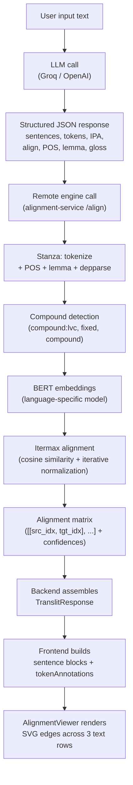
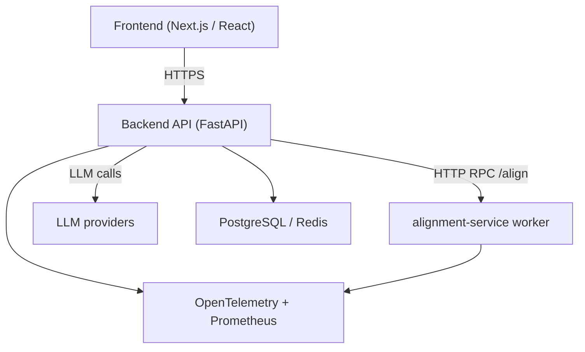

# Cross-Script Alignment System

A distributed NLP system for aligning text across different writing systems, enabling phonetic mapping, transliteration, and token-level analysis.

**Note:** This repository is a structural snapshot for hiring visibility. Proprietary models, alignment logic, and heuristics are replaced with stubs.

---

## System Architecture

The platform uses a multi-stage alignment pipeline:

Client (Next.js UI)  
↓  
API Layer (FastAPI)  
↓  
Alignment Worker (Stanza + BERT + LaBSE)  
↓  
LLM Refinement



---

## System Architecture Diagram



---

## Performance

Latency is tracked as structured logs (milliseconds) across frontend, backend API, and `alignment-service`.

**End-to-end latency path (ms):**
- frontend input → response render
- backend API request time
- alignment-service processing time

**Pipeline stage breakdown (ms):**
- `parsing` → Stanza token grouping / dependency parsing
- `embedding` → BERT embedding generation
- `alignment` → similarity matrix + extraction
- `refinement` → LLM correction for low-confidence spans

**Cold vs warm behavior:**
- cold start includes model/pipeline initialization overhead
- warm requests benefit from singleton/global model caching

**Sample metrics (illustrative):**
- warm request total: `p50 ~420ms`, `p95 ~910ms`
- cold request total: `p50 ~2.8s`, `p95 ~4.6s`

Use `alignment-service/scripts/profile_alignment_service.py` to generate environment-specific p50/p95 and per-request memory summaries.

---

## Engineering Highlights

- Two-tier alignment system combining statistical (BERT) and LLM-based refinement  
- Distributed NLP workers isolating heavy inference from the API layer  
- Singleton model loading to eliminate repeated initialization overhead  
- Full observability stack (OpenTelemetry, Prometheus, Jaeger)  
- Fault-tolerant pipeline with retries and fallback tokenization  

---

## Core Components

### Alignment Engine
- BERT-based token alignment (Awesome-Align inspired)  
- Cosine similarity matrix with iterative normalization  
- Confidence-scored alignment pairs  

### Linguistic Preprocessing
- Dependency parsing via Stanza  
- Token grouping for compounds and multi-word expressions  

### LLM Refinement Layer
- Handles low-confidence alignments  
- Produces corrected phrase-level mappings  

### Visualization Layer
- SVG-based alignment viewer (React)  
- Confidence-weighted edges (dashed for uncertain mappings)  

---

## Design Trade-offs

- **Worker separation:** improves scalability but introduces network overhead  
- **Statistical-first alignment:** ensures deterministic outputs with LLM as fallback  

---

## Architectural Self-Critique

- **Cold-start latency:** large models introduce startup delay  
  → V2: readiness probes and model pre-warming  

- **High memory usage:** multiple language-specific BERT models  
  → V2: ONNX quantization and model optimization  

---

## Running Locally

```bash
# Backend
cd alignment-service && uvicorn main:app

# Frontend
npm install && npm run dev
```

---

## Repository Structure

- `/src`: Next.js frontend (alignment visualization)
- `/alignment-service`: FastAPI NLP backend
- `/monitoring`: Prometheus, Loki, Grafana configs
