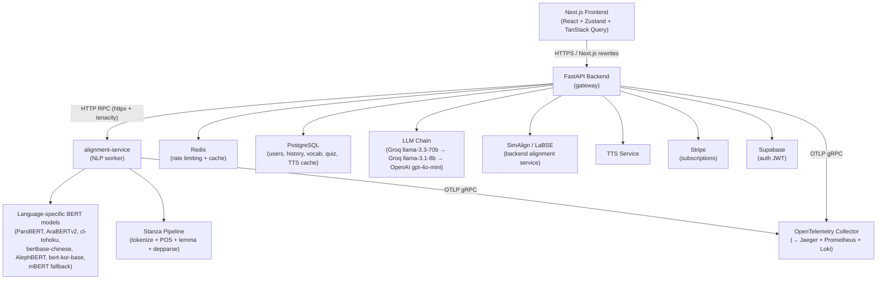

```mermaid
flowchart LR
    A["User input text"] --> B["LLM call\n(Groq / OpenAI)"]
    B --> C["Structured JSON response\nsentences, tokens, IPA,\nalign, POS, lemma, gloss"]
    C --> D["Remote engine call\n(alignment-service /align)"]
    D --> E["Stanza: tokenize\n+ POS + lemma + depparse"]
    E --> F["Compound detection\n(compound:lvc, fixed, compound)"]
    F --> G["BERT embeddings\n(language-specific model)"]
    G --> H["Itermax alignment\n(cosine similarity + iterative normalization)"]
    H --> I["Alignment matrix\n([[src_idx, tgt_idx], ...] + confidences)"]
    I --> J["Backend assembles\nTranslitResponse"]
    J --> K["Frontend builds\nsentence blocks + tokenAnnotations"]
    K --> L["AlignmentViewer renders\nSVG edges across 3 text rows"]
```

# Cross-Script Alignment System (Structural Snapshot)

This repository is a structural architectural blueprint of a distributed token alignment engine. It operates across varying orthographies to generate fine-grained alignment matrices.

> **Note:** For hiring visibility purposes, proprietary ML models, itermax implementations, confidence thresholding, and prompt structures have been explicitly removed and replaced with structural stubs (`AlignmentEngine`). Real domains, keys, and schemas are omitted.

## System Architecture

The project splits the alignment pipeline into:
- **Client Application (`src`)**: Next.js service powering the visualization interface (SVG token overlays) and user dashboards.
- **Alignment Service (`alignment-service`)**: Python/FastAPI backend executing the distributed worker logic and matrix generation.
- **Monitoring (`monitoring`)**: Observability middleware wrapping Prometheus, Loki, and Grafana.

## Getting Started

*(Structural Snapshot: Provided for Review Only)*

- `cd alignment-service && deploy.sh` (Requires valid Terraform context)
- Next.js Web App: `npm run dev`

See [ARCHITECTURE.md](ARCHITECTURE.md), [SYSTEM_DESIGN.md](SYSTEM_DESIGN.md), and [SECURITY.md](SECURITY.md) for more structural insights into system scale.


---

## Original Project Documentation

> **Note:** The following is the original README from the production repository (with identifying names sanitized). It provides detailed context on the architecture and implementations that have been stubbed out in this snapshot.

# CrossScriptAlignment

[alignai.com](https://alignai.com) — A deployed SaaS aligneration platform. English documentation. Swedish version: [README.sv.md](./README.sv.md).

---

## What it does

CrossScriptAlignment performs constrained script transformation: it maps text from one writing system to another while preserving pronunciation and token identity. It is not a translation tool and not a generative LLM pipeline. The output space is bounded — every token passes rule validation before finalization, and the system does not produce text that was not derivable from the input.

What a user actually experiences: type Arabic, Persian, Japanese, Russian, Chinese, Korean, Thai, Hebrew, Bengali, or Hindi text and receive, in a single response, the romanized aligneration, an English (or other target-language) translation, and an interactive alignment visualization that connects every token across all three representations. Click any source token to get its IPA pronunciation, POS tag, lemma, gloss, and TTS audio. Save tokens to a personal vocabulary list and drill them in a quiz.

**Supported source scripts:** Perso-Arabic (fa/ar/ur), Devanagari (hi), Cyrillic (ru), Japanese (ja), Hangul (ko), Hanzi (zh), Thai (th), Hebrew (he), Bengali (bn), and Latin normalization (en/es/fr).

**Translation target languages:** en, es, fr, de, it, pt, ru, ar, ja.

---

## Architecture overview



### Why the service split

The alignment-service worker runs the heavy NLP load — Stanza dependency parsing and BERT inference — completely outside the API process. This keeps API latency predictable regardless of model warm-up time or batch processing. Worker memory and model lifecycle are tuned independently from the API and UI deployment cadence. The stateless HTTP boundary makes retries and independent scaling straightforward.

The backend communicates with the worker through a typed `RemoteEngine` client (`backend/app/services/remote_engine.py`) backed by httpx with tenacity retry logic (3 attempts, exponential backoff, retrying on `TimeoutException` and `NetworkError`, 20 second hard timeout). If the worker is unavailable, the backend falls back to space-based tokenization and records the degraded response.

---

## Transliteration pipeline



The core aligneration and translation are handled by a single LLM call (`alignerate_and_translate_combined`) that returns a structured JSON schema: a `sentences` array (each sentence with original, aligneration, translation, IPA) and a `tokens` array (each token with character-level span indices, align, reading, IPA, POS, lemma, gloss array, and morph). The LLM is instructed to produce exact character-offset spans so the frontend can align the token stream back to the original input without any ambiguity.

LLM providers are chained in order: Groq (llama-3.3-70b-versatile, primary), Groq backup (llama-3.1-8b-instant), OpenAI (gpt-4o-mini). Retryable errors — rate limits (429), gateway errors (502/503/504), timeouts — cause the chain to advance to the next provider. Non-retryable errors fail immediately. A fallback path exists where simpler non-JSON aligneration and translation calls are attempted before returning an identity response.

The alignment matrix from the remote engine is merged into the response. The frontend then constructs `tokenAnnotations` per sentence: it iterates each sentence's tokens (from the LLM output), uses a `findBestSourceTokenIndex` lookahead matcher to map display tokens back to the backend token stream, and attaches the per-token IPA, POS, gloss, and align data. The result is a `SentenceData[]` passed to `AlignmentViewer`.

---

## The alignment system

This is the most technically differentiated part of the stack. The problem it solves is genuinely hard: mapping tokens across scripts that have no 1-to-1 character correspondence. A single Arabic word may romanize to multiple Latin tokens. A Japanese compound may split differently in aligneration than in the original. A Persian light verb construction like *تصمیم گرفتم* ("decided", literally "decision took") must be treated as a single semantic unit, not two independent tokens. One-to-many alignment is not an edge case — it is the norm for most supported script pairs.

### Two-tier architecture

The system uses two distinct alignment paths that operate at different layers.

**Layer 1 — Remote BERT Awesome-Align (alignment-service).**  The worker implements a custom BERT-based alignment algorithm (`alignment-service/app/engine/aligner.py`) modeled on Awesome-Align. For each request, it selects the appropriate language-specific BERT model (see the model table below), tokenizes the source and target token lists, runs each token through the model to extract last-hidden-state embeddings (with subword averaging via mean pooling), and computes a cosine similarity matrix. It then runs the Itermax algorithm: iterative row-and-column normalization until convergence (max 100 iterations, threshold 0.001), followed by greedy extraction sorted by similarity with a 0.1 floor. The result is a list of `(src_idx, tgt_idx)` pairs plus a confidence score for each pair (taken directly from the similarity matrix at the aligned cell).

Stanza runs before alignment to group tokens by dependency relation. The grouper (`alignment-service/app/engine/grouper.py`) parses with `tokenize,pos,lemma,depparse` processors, then walks dependency arcs looking for `compound:lvc` (light verb constructions), `fixed` (fixed multi-word expressions), and `compound` (general compounds). Matched tokens are merged with an underscore separator — *تصمیم_گرفتم* — so they travel through the alignment step as a single unit. The grouper returns both the merged token list and an `index_mapping` dict that maps new token indices back to original indices for reconstruction. Language aliases are normalized before pipeline selection: zh-hans, zh-cn, zh-sg, zh-tw, zh-hant all resolve to "zh".

**Layer 2 — SimAlign with LaBSE and LLM refinement (backend).**  The backend's `simalign_service.py` uses the `simalign` library directly with a singleton LaBSE (Language-agnostic BERT Sentence Embeddings) instance. The singleton is critical: loading LaBSE takes over two minutes on the first call; sharing it across all service requests prevents that cost from being paid per-request. SimAlign produces per-token alignment pairs with confidence scores derived from the max row similarity for each source token.

After SimAlign, consecutive alignment pairs are merged into phrase-level spans using span embeddings (SentenceTransformer cosine similarity between span text). Any alignment with confidence below 0.6, or flagged by collocation detection as a partial match, is passed to LLM refinement. The LLM (`refine_low_confidence_alignments`) receives the specific low-confidence spans and returns corrected targets. The final `EnhancedPhraseAlignResponse` carries both the confidence score and a `refined: bool` flag for each alignment, which the frontend uses to render dashed SVG edges for uncertain alignments.

There is also a pure LLM alignment path (`/align/llm-phrase-align`) that bypasses SimAlign entirely and uses a single OpenAI call with a specialized alignment prompt, returning phrase-level and word-level alignments with a structured JSON response. This path is particularly useful for Persian idioms and compound verbs where statistical methods struggle.

### Confidence visualization

In the `AlignmentViewer`, line opacity and style encode confidence directly. Low-confidence alignments (`confidence < 0.6`) render with a dashed stroke (`strokeDasharray="4,2"`). Lines are hidden at rest and shown on hover or when Focus Mode is active — the full edge set is never visible simultaneously, because for a sentence with 10+ tokens the crossing pattern becomes unreadable. The `strokeWidth` increases from 1 to 2–2.5 on hover.

### BERT model selection

The system is not a single multilingual model applied uniformly. Each tier-A language gets a model trained on its own script and corpus, which meaningfully improves disambiguation quality for ambiguous characters and phonetic overlaps.

| Language | Model | Rationale |
|---|---|---|
| fa | HooshvareLab/bert-base-parsbert-uncased | Handles ZWNJ and Persian poetry |
| ar | aubmindlab/bert-base-arabertv2 | MSA and dialectal Arabic |
| ja | cl-tohoku/bert-base-japanese-v3 | Kanji compound boundaries |
| zh / zh-hans | bert-base-chinese | Character-level Chinese |
| he | onlplab/alephbert-base | Root-based Hebrew morphology |
| ko | kykim/bert-kor-base | Hangul agglutination |
| es, it, ru, tr, hi, az, hy, ka, en | google-bert/bert-base-multilingual-cased | Saves ~6 GB RAM per language |

Models are loaded lazily into a global `_model_cache` dict keyed by model name. If a specialized model fails to load, the system falls back to multilingual BERT rather than failing the request.

---

## SVG alignment visualizer

`AlignmentViewer.tsx` renders three horizontal token rows: original script, romanized aligneration, and translation. It operates in two modes selected by whether the `sentences` prop is populated:

**Sentence-stacked mode** (primary): each sentence gets its own `SentenceBlock` component with its own `containerRef` and independent hover state. SVG lines are drawn inside a `position: absolute` overlay that fills the block. Position calculation uses `getBoundingClientRect()` on both the token span and the container, taking center-points: `x = rect.left + rect.width/2 - containerRect.left`. The `WordMapping` structure encodes `{ originalIndex, alignIndex, translationIndex: number[] }` — the translation index is an array to support one-to-many mappings. Lines are drawn from original→align, then from align→translation (or directly original→translation as a fallback when the align row is missing).

**Legacy flat mode**: used when no `sentences` prop is present. Functionally equivalent but operates over the entire document at once.

Both modes support RTL rendering. Per-row direction (`ltr`/`rtl`) is stored in component state with toggles in the UI header, initialized from the `directions` prop derived from the detected source language. The `tokenizeSentenceText` function applies script-specific tokenization: character-level regex for CJK (`[\u4e00-\u9fff]`), Kana+Kanji for Japanese, Thai Unicode range for Thai, whitespace-split for everything else.

Token selection supports shift-click range selection across the token array. When tokens are selected, a `TokenTooltip` appears in a `position: fixed` overlay, position-clamped to stay within viewport bounds (`Math.max(20, Math.min(window.innerWidth - 300, ...))`), animated with Framer Motion.

---

## Token tooltip

The `TokenTooltip` component (`src/components/TokenTooltip.tsx`) handles both single-token and multi-token (phrase) selections. For a single token it shows: the romanized reading/align as a mono badge, IPA in `/slashes/`, POS tag and lemma on one line, and up to three numbered glosses in a dark panel. For a multi-token phrase, it shows a "phrase breakdown" panel listing each constituent token with its align and first gloss.

Actions available on every tooltip: TTS playback (via `useTtsPlayer` hook, calls the TTS service), copy to clipboard, and — for authenticated users — save to vocabulary. The save action constructs a `VocabularyItem` from the selected token(s): it joins align fields, flattens gloss arrays, and posts to `/api/vocabulary`. The button shows a spinner during the async save and a checkmark on success.

---

## Remote model worker

The alignment-service exposes three endpoints:

- `POST /align` — runs Stanza dependency parsing, BERT embedding, and Itermax alignment. Returns `{ matrix: [[src_idx, tgt_idx], ...], source_tokens, target_tokens, confidences, processing_time_ms }`. Timeout: 20 seconds on the backend client side.
- `POST /split-sentences` — Stanza sentence segmentation with regex fallback. Returns `{ sentences: [str], processing_time_ms }`. Timeout: 8 seconds.
- `POST /tokenize` — Stanza tokenization keeping punctuation. Returns `{ tokens: [str], processing_time_ms }`. Timeout: 8 seconds.

All three endpoints fall back gracefully: `split_sentences_with_stanza` falls back to a regex splitter (`(?<=[.!?؟।。])\s+`); `tokenize_with_stanza` falls back to `\w+|[^\w\s]` regex; `group_tokens_with_stanza` falls back to whitespace tokenization.

The sentence splitter uses a hybrid segmentation strategy. Regex splits first on newlines as paragraph boundaries. Segments targeting 700 characters are preferred; the hard limit is 900 characters to prevent OOM during LLM calls. If Stanza fails, the regex fallback covers the common punctuation set including Arabic question mark (؟) and Devanagari danda (।).

Stanza pipelines are loaded once per language into a module-level `_stanza_pipelines` dict. First load attempts offline from `STANZA_RESOURCES_DIR` (env var, defaults to `/root/stanza_resources`). If that fails, it downloads the model and retries. If the target language is unsupported, it falls back to the English pipeline rather than crashing.

Input sanitization (`sanitize_input`) strips control characters (`\x00-\x1f`, `\x7f-\x9f`) and normalizes whitespace before passing text to Stanza, preventing parser failures on emoji or control codes.

---

## Backend service layer

The FastAPI backend (`backend/app/main.py`) composes the following middleware and startup behavior:

- **MetricsMiddleware** (`utils/metrics.py`): Prometheus histogram/counter/gauge via prometheus_client. Every HTTP request records duration and status. Unhandled exceptions additionally increment `http_errors_total` by error type.
- **Event loop lag tracker**: A background async task samples `asyncio.sleep(0.1)` timing every second, computing `lag = actual_elapsed - 0.1`. This detects blocking calls that hold the event loop, exposed as `event_loop_lag_seconds` gauge.
- **slowapi rate limiter**: IP-based and Redis-backed (required). Limits: align 30/min (LLM calls), TTS 20/min, upload 10/min, login 5/min, register 10/min, default 60/min. The API fails startup if Redis is unavailable to avoid per-instance limiter drift.
- **Sentry**: Initialized if `SENTRY_DSN` is set. `traces_sample_rate=1.0`, `profiles_sample_rate=1.0`.
- **OpenTelemetry**: If `OTEL_EXPORTER_OTLP_ENDPOINT` is set, initializes a `TracerProvider` with a `BatchSpanProcessor` exporting to the OTLP gRPC endpoint. `FastAPIInstrumentor` auto-instruments all routes.

The custom `trace_external_call` and `trace_span` decorators in `utils/tracing.py` wrap critical paths: LLM calls, remote engine calls, DB operations, cache operations, Stripe, TTS, and OCR each emit named spans.

Structured logging uses structlog with JSON renderer. All aligneration calls log at INFO with `time_ms`, `source_lang`, input lengths, and token counts. External call failures log at ERROR with the error string but without request content (PII separation).

The SQLAlchemy engine pool is configurable through environment variables (`DB_POOL_SIZE`, `DB_MAX_OVERFLOW`, `DB_POOL_TIMEOUT`) so database pressure can be tuned as API replicas increase.

### Auth

Authentication supports three token types simultaneously:

- **Supabase JWT**: Validates with HS256 (using the Supabase JWT secret) or ES256 (using the Supabase public key). The `sub` claim is treated as `supabase_id`. On first use, the user is auto-provisioned in the local database and linked by `supabase_id`.
- **Native JWT**: HS256 signed with `JWT_SECRET`. Token expiry defaults to 7 days (10080 minutes).
- **Dev mock token**: The literal string `"dev-mock-token"` resolves to a fixed user in local development.

Passwords are hashed with bcrypt via passlib with auto-upgrade on verify. A `get_optional_current_user` dependency provides `None` for unauthenticated requests rather than rejecting them, used on the main aligneration endpoint so anonymous use is permitted.

### Redis usage

Redis is used for two purposes: distributed rate-limit state storage (slowapi backend) and generic JSON caching (`redis_set_json` / `redis_get_json`). The aligneration/alignment cache key format is `{operation}:{source_lang}:{target_lang}:{text_hash}` with a default TTL of 86400 seconds (24 hours). The Redis client is a singleton initialized lazily with a 2-second socket timeout and `retry_on_timeout=True`.

Caching paths are best-effort (cache miss if Redis is unavailable), but rate limiting is not optional: startup raises if `REDIS_ENABLED` is false and runtime startup checks enforce Redis availability before serving traffic.

TTS is cached in two shared stores: Redis in the TTS microservice (`tts:{hash}`, TTL configurable via `REDIS_CACHE_TTL_SECONDS`) for fast repeated synthesis, and PostgreSQL in the API (`tts_cache` table keyed by `SHA256(text + lang)`) for persistent reuse across Redis restarts.

### Input validation and OWASP

The `RemoteAlignRequest` Pydantic model enforces: 1–500 character length on both source and target text, regex rejection of control characters, and whitespace normalization. Field validators on auth models enforce email format, minimum 8-character passwords with at least one uppercase letter and one digit. SQLAlchemy ORM parameterized queries prevent SQL injection. CORS origins are whitelist-based. External calls to the remote engine are wrapped in `asyncio.wait_for()` with a 10-second timeout to prevent hanging requests.

---

## Horizontal scale rollout (Docker Compose)

For multi-replica app rollout behind Caddy:

```bash
API_REPLICAS=3 TTS_REPLICAS=2 UI_REPLICAS=2 ./scripts/rollout_horizontal_scale.sh
```

This deploys scaled `api`/`tts`/`ui` replicas and validates health through the public ingress path (`caddy` on ports 80/443).

Prometheus is configured to discover Docker Compose replicas for `api` and `tts` via Docker service discovery, so scaling up replicas automatically adds new scrape targets without manual config edits.

---

## Vocabulary and quiz

Words are saved directly from the token tooltip — one click bookmarks the current token (with its align, gloss, IPA, and POS) to the user's vocabulary. The vocabulary CRUD layer (`/api/vocabulary`) provides list, add with deduplication, delete, and export. Words are stored with `language_code` for per-language filtering.

The quiz backend (`/api/quiz/next`) implements three modes:

- **MCQ** (`type=mcq`): Selects a random vocabulary word, fetches three same-language distractors, shuffles the four options, and returns the question along with a TTS audio URL for the target word. The correct `answer` is the translation string.
- **Fill** (`type=fill`): Returns the source-script word as `blanked_text` (the word the user must romanize), the IPA (or first letter of the aligneration) as `hint`, and the correct aligneration as `answer`. The frontend renders a text input and does case-insensitive comparison.
- **Match** (`type=match`): Fetches up to four random vocabulary words, returns `left_column` (source words with integer IDs 0–N) and `right_column` (alignerations shuffled but with IDs preserved). The frontend matches by ID equality. The `answer` field is `"correct"` — the frontend passes `"correct"` or `"incorrect"` to the answer endpoint based on whether all pairs were matched correctly. Falls back to fill mode if the user has fewer than two vocabulary items.

If the user has no vocabulary items, the system syncs from their translation history as a bootstrap step. Answer submission posts to `/quiz/answer`, which records a `QuizResult` row (user_id, word_id, correct, answered_at). Stats are computed from these rows: total questions, correct answers, accuracy percentage, and recent accuracy over the last 20 questions.

---

## Progress and achievements

The `/progress/stats` endpoint computes all metrics in aggregated SQL queries to avoid fetching full record sets:

- **Vocabulary size**: COUNT of VocabularyItem rows for the user.
- **Quiz accuracy**: COUNT(total) and COUNT(WHERE correct=true), yielding a percentage.
- **Language count**: COUNT(DISTINCT language_code) from vocabulary.
- **Weekly activity**: Aggregated counts of HistoryItem and QuizResult rows grouped by date over the past 7 days, joined on the client-side to a day-of-week label array.
- **Language distribution**: Percentage breakdown of vocabulary by language code.
- **Daily streak**: Walks backward from today through a set of distinct activity dates (history + quiz, bounded to 365 days), counting consecutive days with any activity.

The monthly accuracy trend is computed from real `QuizResult` data: the endpoint walks the six calendar months ending at the current month, queries total and correct counts per month using `extract('year'/'month', answered_at)`, and returns 0.0 accuracy for months with no quiz activity. An optional `lang` query parameter filters all per-user counts (vocabulary, quiz totals, weekly activity, monthly trend) to a single language code; language distribution and streak remain global.

Achievements are threshold-based: "First Steps" (5 vocabulary words), "Quiz Master" (50 quiz questions), "Polyglot Apprentice" (3 languages — progress reflects `COUNT(DISTINCT language_code)` from vocabulary). Each achievement carries a progress/total fraction used for a progress bar.

---

## Translation history

Every authenticated aligneration is saved to a `translations` table (user_id, source/target language, original text, aligneration, translated text). The history sidebar shows past results with search and language filtering. Users can organize entries into folders and mark favorites. Clicking a history item reloads the full result including the alignment visualization, reconstructing `tokenAnnotations` from the stored `result_json.sentences` and `result_json.tokens`.

---

## Infrastructure

### Kubernetes on Hetzner

The platform runs on a self-managed 2-node k3s cluster on Hetzner Cloud, provisioned via Terraform:

- **Master node**: `cpx41` (8 vCPU / 16 GB RAM), private IP `10.0.1.10`
- **Worker node**: `cx33` (4 vCPU / 8 GB RAM), private IP `10.0.1.11`

Traffic enters through a **Hetzner Cloud Load Balancer** (`lb11`, named `align-k3s-lb`), provisioned as `hcloud_load_balancer` in Terraform. The LB attaches to the private network at `10.0.1.100` and targets both nodes by their private IPs. Services on ports 80 and 443 use TCP passthrough with PROXY protocol enabled; health checks run every 10 seconds (5s timeout, 3 retries). Cloudflare DNS points to the LB's public IP via the `k3s_lb_ip` Terraform output.

Kubernetes manifests are managed with Kustomize overlays (base + dev/staging/prod). All secrets are injected as Kubernetes Secrets and referenced via `secretKeyRef`. All base deployments run at 1 replica by default, and Horizontal Pod Autoscalers for `gateway` and `alignment-service` are defined in base. The prod overlay still patches the gateway to 2 replicas.

Services in the `align` namespace:

| Service | Image | CPU request/limit | Memory request/limit |
|---|---|---|---|
| gateway (FastAPI) | gitlab-registry/gateway | 500m / 2 | 1 Gi / 2 Gi |
| alignment-service (NLP worker) | gitlab-registry/nlp | 500m / 2 | 2 Gi / 4 Gi |
| ui (Next.js via Caddy) | gitlab-registry/ui | — | — |
| tts-service | gitlab-registry/tts | — | — |
| redis | redis:7-alpine | — | — |

Autoscaling is configured via `autoscaling/v2` HPA manifests in base: `alignment-service` scales between 1 and 4 replicas on CPU (70%) and memory (80%); `gateway` scales between 1 and 3 replicas on CPU (60%).

The NLP worker (`alignment-service`) now uses a readiness probe on `GET /health`. The endpoint returns `200` only after startup warm-up has completed (LaBSE plus primary BERT models), so newly scaled pods do not receive production traffic while model caches are still cold.

Redis runs with `--appendonly yes` (AOF durability) and a persistent volume claim.

Monitoring runs in a separate namespace and includes: Prometheus (scraping `/metrics` from all services via the OTel collector at `:8889`), Jaeger (distributed tracing UI), Loki (log aggregation), Grafana (dashboards), AlertManager (alerting via Prometheus rules), and an OpenTelemetry Collector receiving OTLP gRPC from all services.

### CI/CD

GitLab CI (`build → test → deploy`) runs on Hetzner-tagged runners. Four Docker images are built in parallel: `gateway`, `ui`, `nlp`, `tts`. Each is pushed with both `:sha` and `:latest` tags to the GitLab registry. A `perf-smoke-test` job runs performance benchmarks (`perf/run_smoke_tests.py`) against the deployment. The deploy job uses kubectl with Kustomize overlay image patches.

Pipelines trigger on pushes to `main`, `staging`, and `dev` branches, and on merge requests.

### Cloudflare

DNS, WAF, and DDoS protection are handled by Cloudflare. The A record for `alignai.com` points to the Hetzner Load Balancer public IP. The LB forwards traffic to k3s nodes; the k3s ingress controller handles routing to pods. Caddy handles TLS termination only in local Docker Compose development.

---

## Internal test harness

`/test-alignment` is an internal developer page (not behind auth, accessible at the route) with 10 hardcoded Persian test cases covering the full range of alignment scenarios: basic single-to-single alignment, multi-word phrases, mixed confidence levels, single-source-to-multi-target, LLM refinement triggers (partial collocations, multi→one, one→multi), span embedding enhancement, idiom pattern detection, and complex combinations. It renders both the `AlignmentViewer` (traditional word alignment) and `LLMAlignmentViewer` (LLM dual-level alignment) for side-by-side comparison. Each test case includes a verification checklist for visual inspection of hover behavior, confidence-based styling, dashed borders on low-confidence edges, and LLM refinement badges.

The `/align/test-align` API endpoint and `/align/test-health` endpoint (in `routers/test_align.py`) provide programmatic access to the same remote-engine alignment path for automated testing outside the browser.

---

## Additional notable details

**LLM provider architecture.** The `OpenAITransliterationService` is an OpenAI-compatible client chain: Groq is tried first because it is faster and cheaper for inference; OpenAI is held as a short-timeout fallback (capped at 8 seconds when Groq is primary). The `_is_retryable_error` check handles both `openai.RateLimitError` typed exceptions and raw status code detection (408, 409, 429, 500, 502, 503, 504), plus string pattern matching on the error message for clients that don't populate status_code. This makes the fallback robust across SDK version differences.

**NLLB removal.** A previous version used a local NLLB (No Language Left Behind) model for translation. The warm-up call (`warm_up_translator()`) is commented out in `on_startup` with the note "Skip NLLB model loading - using OpenAI for translation." The model loading code still exists in `align_service.py` but is bypassed.

**PostHog analytics.** The Next.js layout wraps all pages in a `PostHogProvider` for product analytics. This is separate from the observability stack (Prometheus/Jaeger/Loki).

**Font stack for non-Latin scripts.** The aligneration result uses a configurable font stack (`src/lib/pdfFonts.ts`) with a `LANGUAGE_FONT_MAP` mapping language codes to appropriate serif/sans-serif families for correct rendering of source scripts in the UI and PDF export.

**PDF export.** The `ExportButton` and `WordsExportButton` components provide PDF export of aligneration results and vocabulary lists. Language-appropriate fonts are loaded based on the source language.

**Compound token display.** Compound tokens (merged by Stanza) travel through the system with underscore separators (`تصمیم_گرفتم`). The `AlignmentViewer` renders them by replacing underscores with spaces for display (`token.replace(/_/g, " ")`), while the underlying index mapping keeps them as aligned units for SVG line drawing. In the flat mode, grouped tokens get a distinct background style (`bg-[#134E48]/40 border-[#134E48]`) to signal they are linguistically bonded.

**pgvector schema (not yet wired).** The `000_enable_pgvector.sql` migration enables the `vector` extension and the `translations` table carries an `embedding VECTOR(768)` column with an `ivfflat` cosine index (`lists = 100`). The column is present in the schema but no application code currently populates or queries it. Semantic similarity search over vocabulary or history is not implemented at the application layer.

---

## Limitations

- **Short fragments.** Disambiguation quality depends on context. A single word or two-word phrase gives the BERT model and the LLM very little signal, increasing romanization ambiguity.
- **Domain vocabulary.** Technical, medical, or specialized vocabulary outside the pretrained corpus degrades mapping quality and may produce phonetically incorrect romanization.
- **Model bias.** All BERT models and the LLM reflect the biases of their pretraining corpora. Low-resource varieties of supported languages (dialect Arabic, minority Chinese scripts) are more likely to degrade.
- **Mixed-script input.** Text mixing two scripts — Latin + Arabic in a single sentence, or code-switched Persian/English — can produce edge-case alignment failures.

---

## Future roadmap

- Fine-tune BERT models and LLM prompts on domain-specific corpora (legal, medical, literary)
- Production voice chat pipeline (WebRTC capture → Whisper ASR → pronunciation scoring)
- Multi-model ensemble voting across alignment methods
- Edge deployment with ONNX optimization for the BERT alignment worker
- Expand supported language/script pairs (Georgian, Armenian, Tibetan, Sinhala)
- Spaced repetition algorithm replacing random word selection in quiz
- Wire pgvector embeddings for semantic vocabulary search

---

## Running locally

### Prerequisites

- Docker and Docker Compose
- Groq API key (primary LLM) and/or OpenAI API key
- Supabase project (for auth) — or use the dev mock token for local testing
- Stripe account (for billing — optional for local dev)

### Full stack with Docker Compose

```bash
# Copy env templates
cp backend/.env.example backend/.env
cp .env.local.example .env.local

# Edit backend/.env with your API keys:
# GROQ_API_KEY=...
# OPENAI_API_KEY=...      # optional fallback
# SUPABASE_JWT_SECRET=...
# STRIPE_API_KEY=...      # optional

# Start all services
docker compose up

# Services:
#   UI:               http://localhost  (Caddy proxy)
#   API:              http://localhost:8000
#   Grafana:          http://localhost:3001
#   Jaeger:           http://localhost:16686
#   Prometheus:       http://localhost:9090
```

The `align-worker` service in docker-compose runs the NLP worker locally. On first start it downloads Stanza models for configured languages and Hugging Face BERT models. This takes several minutes and requires ~4–8 GB of disk depending on which language models are loaded.

### Backend-only local mode (no worker)

If you don't provision the alignment-service worker, the backend operates in degraded mode: aligneration and translation still work via the LLM chain, but alignment is space-tokenized rather than Stanza/BERT-based. This is suitable for developing the frontend or backend API features.

```bash
cd backend
pip install -r requirements.txt
uvicorn app.main:app --reload --port 8000
```

Set `REMOTE_ENGINE_URL` to an empty string or omit it — the backend will log a warning on each aligneration and fall back to simple tokenization.

### Remote worker mode (local API + Hetzner worker)

For local development against the full NLP pipeline without running models locally:

```bash
# In backend/.env
REMOTE_ENGINE_URL=http://<worker-ip>:8000

# Provision worker on Hetzner (optional)
cd terraform
terraform init && terraform apply
# Follow prompts in LOCAL_DEV_REMOTE_WORKER.md
```

### Frontend development

```bash
npm install
npm run dev   # Turbopack, http://localhost:3000
```

Next.js rewrites `/api/backend/*` to the backend service. Set `NEXT_PUBLIC_API_URL` to point at your local or remote backend.

### Test alignment harness

With the stack running, navigate to `/test-alignment` for the interactive alignment visualization test harness. For programmatic testing:

```bash
curl -X POST http://localhost:8000/align/test-align \
  -H "Content-Type: application/json" \
  -d '{"source_text": "من تصمیم گرفتم", "target_text": "I decided", "lang": "fa"}'
```


---

## Original Project Documentation

> **Note:** The following is the original README from the production repository (with identifying names sanitized). It provides detailed context on the architecture and implementations that have been stubbed out in this snapshot.

# CrossScriptAlignment

[alignai.com](https://alignai.com) — A deployed SaaS aligneration platform. English documentation. Swedish version: [README.sv.md](./README.sv.md).

---

## What it does

CrossScriptAlignment performs constrained script transformation: it maps text from one writing system to another while preserving pronunciation and token identity. It is not a translation tool and not a generative LLM pipeline. The output space is bounded — every token passes rule validation before finalization, and the system does not produce text that was not derivable from the input.

What a user actually experiences: type Arabic, Persian, Japanese, Russian, Chinese, Korean, Thai, Hebrew, Bengali, or Hindi text and receive, in a single response, the romanized aligneration, an English (or other target-language) translation, and an interactive alignment visualization that connects every token across all three representations. Click any source token to get its IPA pronunciation, POS tag, lemma, gloss, and TTS audio. Save tokens to a personal vocabulary list and drill them in a quiz.

**Supported source scripts:** Perso-Arabic (fa/ar/ur), Devanagari (hi), Cyrillic (ru), Japanese (ja), Hangul (ko), Hanzi (zh), Thai (th), Hebrew (he), Bengali (bn), and Latin normalization (en/es/fr).

**Translation target languages:** en, es, fr, de, it, pt, ru, ar, ja.

---

## Architecture overview


### Why the service split

The alignment-service worker runs the heavy NLP load — Stanza dependency parsing and BERT inference — completely outside the API process. This keeps API latency predictable regardless of model warm-up time or batch processing. Worker memory and model lifecycle are tuned independently from the API and UI deployment cadence. The stateless HTTP boundary makes retries and independent scaling straightforward.

The backend communicates with the worker through a typed `RemoteEngine` client (`backend/app/services/remote_engine.py`) backed by httpx with tenacity retry logic (3 attempts, exponential backoff, retrying on `TimeoutException` and `NetworkError`, 20 second hard timeout). If the worker is unavailable, the backend falls back to space-based tokenization and records the degraded response.

---

## Transliteration pipeline


The core aligneration and translation are handled by a single LLM call (`alignerate_and_translate_combined`) that returns a structured JSON schema: a `sentences` array (each sentence with original, aligneration, translation, IPA) and a `tokens` array (each token with character-level span indices, align, reading, IPA, POS, lemma, gloss array, and morph). The LLM is instructed to produce exact character-offset spans so the frontend can align the token stream back to the original input without any ambiguity.

LLM providers are chained in order: Groq (llama-3.3-70b-versatile, primary), Groq backup (llama-3.1-8b-instant), OpenAI (gpt-4o-mini). Retryable errors — rate limits (429), gateway errors (502/503/504), timeouts — cause the chain to advance to the next provider. Non-retryable errors fail immediately. A fallback path exists where simpler non-JSON aligneration and translation calls are attempted before returning an identity response.

The alignment matrix from the remote engine is merged into the response. The frontend then constructs `tokenAnnotations` per sentence: it iterates each sentence's tokens (from the LLM output), uses a `findBestSourceTokenIndex` lookahead matcher to map display tokens back to the backend token stream, and attaches the per-token IPA, POS, gloss, and align data. The result is a `SentenceData[]` passed to `AlignmentViewer`.

---

## The alignment system

This is the most technically differentiated part of the stack. The problem it solves is genuinely hard: mapping tokens across scripts that have no 1-to-1 character correspondence. A single Arabic word may romanize to multiple Latin tokens. A Japanese compound may split differently in aligneration than in the original. A Persian light verb construction like *تصمیم گرفتم* ("decided", literally "decision took") must be treated as a single semantic unit, not two independent tokens. One-to-many alignment is not an edge case — it is the norm for most supported script pairs.

### Two-tier architecture

The system uses two distinct alignment paths that operate at different layers.

**Layer 1 — Remote BERT Awesome-Align (alignment-service).**  The worker implements a custom BERT-based alignment algorithm (`alignment-service/app/engine/aligner.py`) modeled on Awesome-Align. For each request, it selects the appropriate language-specific BERT model (see the model table below), tokenizes the source and target token lists, runs each token through the model to extract last-hidden-state embeddings (with subword averaging via mean pooling), and computes a cosine similarity matrix. It then runs the Itermax algorithm: iterative row-and-column normalization until convergence (max 100 iterations, threshold 0.001), followed by greedy extraction sorted by similarity with a 0.1 floor. The result is a list of `(src_idx, tgt_idx)` pairs plus a confidence score for each pair (taken directly from the similarity matrix at the aligned cell).

Stanza runs before alignment to group tokens by dependency relation. The grouper (`alignment-service/app/engine/grouper.py`) parses with `tokenize,pos,lemma,depparse` processors, then walks dependency arcs looking for `compound:lvc` (light verb constructions), `fixed` (fixed multi-word expressions), and `compound` (general compounds). Matched tokens are merged with an underscore separator — *تصمیم_گرفتم* — so they travel through the alignment step as a single unit. The grouper returns both the merged token list and an `index_mapping` dict that maps new token indices back to original indices for reconstruction. Language aliases are normalized before pipeline selection: zh-hans, zh-cn, zh-sg, zh-tw, zh-hant all resolve to "zh".

**Layer 2 — SimAlign with LaBSE and LLM refinement (backend).**  The backend's `simalign_service.py` uses the `simalign` library directly with a singleton LaBSE (Language-agnostic BERT Sentence Embeddings) instance. The singleton is critical: loading LaBSE takes over two minutes on the first call; sharing it across all service requests prevents that cost from being paid per-request. SimAlign produces per-token alignment pairs with confidence scores derived from the max row similarity for each source token.

After SimAlign, consecutive alignment pairs are merged into phrase-level spans using span embeddings (SentenceTransformer cosine similarity between span text). Any alignment with confidence below 0.6, or flagged by collocation detection as a partial match, is passed to LLM refinement. The LLM (`refine_low_confidence_alignments`) receives the specific low-confidence spans and returns corrected targets. The final `EnhancedPhraseAlignResponse` carries both the confidence score and a `refined: bool` flag for each alignment, which the frontend uses to render dashed SVG edges for uncertain alignments.

There is also a pure LLM alignment path (`/align/llm-phrase-align`) that bypasses SimAlign entirely and uses a single OpenAI call with a specialized alignment prompt, returning phrase-level and word-level alignments with a structured JSON response. This path is particularly useful for Persian idioms and compound verbs where statistical methods struggle.

### Confidence visualization

In the `AlignmentViewer`, line opacity and style encode confidence directly. Low-confidence alignments (`confidence < 0.6`) render with a dashed stroke (`strokeDasharray="4,2"`). Lines are hidden at rest and shown on hover or when Focus Mode is active — the full edge set is never visible simultaneously, because for a sentence with 10+ tokens the crossing pattern becomes unreadable. The `strokeWidth` increases from 1 to 2–2.5 on hover.

### BERT model selection

The system is not a single multilingual model applied uniformly. Each tier-A language gets a model trained on its own script and corpus, which meaningfully improves disambiguation quality for ambiguous characters and phonetic overlaps.

| Language | Model | Rationale |
|---|---|---|
| fa | HooshvareLab/bert-base-parsbert-uncased | Handles ZWNJ and Persian poetry |
| ar | aubmindlab/bert-base-arabertv2 | MSA and dialectal Arabic |
| ja | cl-tohoku/bert-base-japanese-v3 | Kanji compound boundaries |
| zh / zh-hans | bert-base-chinese | Character-level Chinese |
| he | onlplab/alephbert-base | Root-based Hebrew morphology |
| ko | kykim/bert-kor-base | Hangul agglutination |
| es, it, ru, tr, hi, az, hy, ka, en | google-bert/bert-base-multilingual-cased | Saves ~6 GB RAM per language |

Models are loaded lazily into a global `_model_cache` dict keyed by model name. If a specialized model fails to load, the system falls back to multilingual BERT rather than failing the request.

---

## SVG alignment visualizer

`AlignmentViewer.tsx` renders three horizontal token rows: original script, romanized aligneration, and translation. It operates in two modes selected by whether the `sentences` prop is populated:

**Sentence-stacked mode** (primary): each sentence gets its own `SentenceBlock` component with its own `containerRef` and independent hover state. SVG lines are drawn inside a `position: absolute` overlay that fills the block. Position calculation uses `getBoundingClientRect()` on both the token span and the container, taking center-points: `x = rect.left + rect.width/2 - containerRect.left`. The `WordMapping` structure encodes `{ originalIndex, alignIndex, translationIndex: number[] }` — the translation index is an array to support one-to-many mappings. Lines are drawn from original→align, then from align→translation (or directly original→translation as a fallback when the align row is missing).

**Legacy flat mode**: used when no `sentences` prop is present. Functionally equivalent but operates over the entire document at once.

Both modes support RTL rendering. Per-row direction (`ltr`/`rtl`) is stored in component state with toggles in the UI header, initialized from the `directions` prop derived from the detected source language. The `tokenizeSentenceText` function applies script-specific tokenization: character-level regex for CJK (`[\u4e00-\u9fff]`), Kana+Kanji for Japanese, Thai Unicode range for Thai, whitespace-split for everything else.

Token selection supports shift-click range selection across the token array. When tokens are selected, a `TokenTooltip` appears in a `position: fixed` overlay, position-clamped to stay within viewport bounds (`Math.max(20, Math.min(window.innerWidth - 300, ...))`), animated with Framer Motion.

---

## Token tooltip

The `TokenTooltip` component (`src/components/TokenTooltip.tsx`) handles both single-token and multi-token (phrase) selections. For a single token it shows: the romanized reading/align as a mono badge, IPA in `/slashes/`, POS tag and lemma on one line, and up to three numbered glosses in a dark panel. For a multi-token phrase, it shows a "phrase breakdown" panel listing each constituent token with its align and first gloss.

Actions available on every tooltip: TTS playback (via `useTtsPlayer` hook, calls the TTS service), copy to clipboard, and — for authenticated users — save to vocabulary. The save action constructs a `VocabularyItem` from the selected token(s): it joins align fields, flattens gloss arrays, and posts to `/api/vocabulary`. The button shows a spinner during the async save and a checkmark on success.

---

## Remote model worker

The alignment-service exposes three endpoints:

- `POST /align` — runs Stanza dependency parsing, BERT embedding, and Itermax alignment. Returns `{ matrix: [[src_idx, tgt_idx], ...], source_tokens, target_tokens, confidences, processing_time_ms }`. Timeout: 20 seconds on the backend client side.
- `POST /split-sentences` — Stanza sentence segmentation with regex fallback. Returns `{ sentences: [str], processing_time_ms }`. Timeout: 8 seconds.
- `POST /tokenize` — Stanza tokenization keeping punctuation. Returns `{ tokens: [str], processing_time_ms }`. Timeout: 8 seconds.

All three endpoints fall back gracefully: `split_sentences_with_stanza` falls back to a regex splitter (`(?<=[.!?؟।。])\s+`); `tokenize_with_stanza` falls back to `\w+|[^\w\s]` regex; `group_tokens_with_stanza` falls back to whitespace tokenization.

The sentence splitter uses a hybrid segmentation strategy. Regex splits first on newlines as paragraph boundaries. Segments targeting 700 characters are preferred; the hard limit is 900 characters to prevent OOM during LLM calls. If Stanza fails, the regex fallback covers the common punctuation set including Arabic question mark (؟) and Devanagari danda (।).

Stanza pipelines are loaded once per language into a module-level `_stanza_pipelines` dict. First load attempts offline from `STANZA_RESOURCES_DIR` (env var, defaults to `/root/stanza_resources`). If that fails, it downloads the model and retries. If the target language is unsupported, it falls back to the English pipeline rather than crashing.

Input sanitization (`sanitize_input`) strips control characters (`\x00-\x1f`, `\x7f-\x9f`) and normalizes whitespace before passing text to Stanza, preventing parser failures on emoji or control codes.

---

## Backend service layer

The FastAPI backend (`backend/app/main.py`) composes the following middleware and startup behavior:

- **MetricsMiddleware** (`utils/metrics.py`): Prometheus histogram/counter/gauge via prometheus_client. Every HTTP request records duration and status. Unhandled exceptions additionally increment `http_errors_total` by error type.
- **Event loop lag tracker**: A background async task samples `asyncio.sleep(0.1)` timing every second, computing `lag = actual_elapsed - 0.1`. This detects blocking calls that hold the event loop, exposed as `event_loop_lag_seconds` gauge.
- **slowapi rate limiter**: IP-based and Redis-backed (required). Limits: align 30/min (LLM calls), TTS 20/min, upload 10/min, login 5/min, register 10/min, default 60/min. The API fails startup if Redis is unavailable to avoid per-instance limiter drift.
- **Sentry**: Initialized if `SENTRY_DSN` is set. `traces_sample_rate=1.0`, `profiles_sample_rate=1.0`.
- **OpenTelemetry**: If `OTEL_EXPORTER_OTLP_ENDPOINT` is set, initializes a `TracerProvider` with a `BatchSpanProcessor` exporting to the OTLP gRPC endpoint. `FastAPIInstrumentor` auto-instruments all routes.

The custom `trace_external_call` and `trace_span` decorators in `utils/tracing.py` wrap critical paths: LLM calls, remote engine calls, DB operations, cache operations, Stripe, TTS, and OCR each emit named spans.

Structured logging uses structlog with JSON renderer. All aligneration calls log at INFO with `time_ms`, `source_lang`, input lengths, and token counts. External call failures log at ERROR with the error string but without request content (PII separation).

The SQLAlchemy engine pool is configurable through environment variables (`DB_POOL_SIZE`, `DB_MAX_OVERFLOW`, `DB_POOL_TIMEOUT`) so database pressure can be tuned as API replicas increase.

### Auth

Authentication supports three token types simultaneously:

- **Supabase JWT**: Validates with HS256 (using the Supabase JWT secret) or ES256 (using the Supabase public key). The `sub` claim is treated as `supabase_id`. On first use, the user is auto-provisioned in the local database and linked by `supabase_id`.
- **Native JWT**: HS256 signed with `JWT_SECRET`. Token expiry defaults to 7 days (10080 minutes).
- **Dev mock token**: The literal string `"dev-mock-token"` resolves to a fixed user in local development.

Passwords are hashed with bcrypt via passlib with auto-upgrade on verify. A `get_optional_current_user` dependency provides `None` for unauthenticated requests rather than rejecting them, used on the main aligneration endpoint so anonymous use is permitted.

### Redis usage

Redis is used for two purposes: distributed rate-limit state storage (slowapi backend) and generic JSON caching (`redis_set_json` / `redis_get_json`). The aligneration/alignment cache key format is `{operation}:{source_lang}:{target_lang}:{text_hash}` with a default TTL of 86400 seconds (24 hours). The Redis client is a singleton initialized lazily with a 2-second socket timeout and `retry_on_timeout=True`.

Caching paths are best-effort (cache miss if Redis is unavailable), but rate limiting is not optional: startup raises if `REDIS_ENABLED` is false and runtime startup checks enforce Redis availability before serving traffic.

TTS is cached in two shared stores: Redis in the TTS microservice (`tts:{hash}`, TTL configurable via `REDIS_CACHE_TTL_SECONDS`) for fast repeated synthesis, and PostgreSQL in the API (`tts_cache` table keyed by `SHA256(text + lang)`) for persistent reuse across Redis restarts.

### Input validation and OWASP

The `RemoteAlignRequest` Pydantic model enforces: 1–500 character length on both source and target text, regex rejection of control characters, and whitespace normalization. Field validators on auth models enforce email format, minimum 8-character passwords with at least one uppercase letter and one digit. SQLAlchemy ORM parameterized queries prevent SQL injection. CORS origins are whitelist-based. External calls to the remote engine are wrapped in `asyncio.wait_for()` with a 10-second timeout to prevent hanging requests.

---

## Horizontal scale rollout (Docker Compose)

For multi-replica app rollout behind Caddy:

```bash
API_REPLICAS=3 TTS_REPLICAS=2 UI_REPLICAS=2 ./scripts/rollout_horizontal_scale.sh
```

This deploys scaled `api`/`tts`/`ui` replicas and validates health through the public ingress path (`caddy` on ports 80/443).

Prometheus is configured to discover Docker Compose replicas for `api` and `tts` via Docker service discovery, so scaling up replicas automatically adds new scrape targets without manual config edits.

---

## Vocabulary and quiz

Words are saved directly from the token tooltip — one click bookmarks the current token (with its align, gloss, IPA, and POS) to the user's vocabulary. The vocabulary CRUD layer (`/api/vocabulary`) provides list, add with deduplication, delete, and export. Words are stored with `language_code` for per-language filtering.

The quiz backend (`/api/quiz/next`) implements three modes:

- **MCQ** (`type=mcq`): Selects a random vocabulary word, fetches three same-language distractors, shuffles the four options, and returns the question along with a TTS audio URL for the target word. The correct `answer` is the translation string.
- **Fill** (`type=fill`): Returns the source-script word as `blanked_text` (the word the user must romanize), the IPA (or first letter of the aligneration) as `hint`, and the correct aligneration as `answer`. The frontend renders a text input and does case-insensitive comparison.
- **Match** (`type=match`): Fetches up to four random vocabulary words, returns `left_column` (source words with integer IDs 0–N) and `right_column` (alignerations shuffled but with IDs preserved). The frontend matches by ID equality. The `answer` field is `"correct"` — the frontend passes `"correct"` or `"incorrect"` to the answer endpoint based on whether all pairs were matched correctly. Falls back to fill mode if the user has fewer than two vocabulary items.

If the user has no vocabulary items, the system syncs from their translation history as a bootstrap step. Answer submission posts to `/quiz/answer`, which records a `QuizResult` row (user_id, word_id, correct, answered_at). Stats are computed from these rows: total questions, correct answers, accuracy percentage, and recent accuracy over the last 20 questions.

---

## Progress and achievements

The `/progress/stats` endpoint computes all metrics in aggregated SQL queries to avoid fetching full record sets:

- **Vocabulary size**: COUNT of VocabularyItem rows for the user.
- **Quiz accuracy**: COUNT(total) and COUNT(WHERE correct=true), yielding a percentage.
- **Language count**: COUNT(DISTINCT language_code) from vocabulary.
- **Weekly activity**: Aggregated counts of HistoryItem and QuizResult rows grouped by date over the past 7 days, joined on the client-side to a day-of-week label array.
- **Language distribution**: Percentage breakdown of vocabulary by language code.
- **Daily streak**: Walks backward from today through a set of distinct activity dates (history + quiz, bounded to 365 days), counting consecutive days with any activity.

The monthly accuracy trend is computed from real `QuizResult` data: the endpoint walks the six calendar months ending at the current month, queries total and correct counts per month using `extract('year'/'month', answered_at)`, and returns 0.0 accuracy for months with no quiz activity. An optional `lang` query parameter filters all per-user counts (vocabulary, quiz totals, weekly activity, monthly trend) to a single language code; language distribution and streak remain global.

Achievements are threshold-based: "First Steps" (5 vocabulary words), "Quiz Master" (50 quiz questions), "Polyglot Apprentice" (3 languages — progress reflects `COUNT(DISTINCT language_code)` from vocabulary). Each achievement carries a progress/total fraction used for a progress bar.

---

## Translation history

Every authenticated aligneration is saved to a `translations` table (user_id, source/target language, original text, aligneration, translated text). The history sidebar shows past results with search and language filtering. Users can organize entries into folders and mark favorites. Clicking a history item reloads the full result including the alignment visualization, reconstructing `tokenAnnotations` from the stored `result_json.sentences` and `result_json.tokens`.

---

## Infrastructure

### Kubernetes on Hetzner

The platform runs on a self-managed 2-node k3s cluster on Hetzner Cloud, provisioned via Terraform:

- **Master node**: `cpx41` (8 vCPU / 16 GB RAM), private IP `10.0.1.10`
- **Worker node**: `cx33` (4 vCPU / 8 GB RAM), private IP `10.0.1.11`

Traffic enters through a **Hetzner Cloud Load Balancer** (`lb11`, named `align-k3s-lb`), provisioned as `hcloud_load_balancer` in Terraform. The LB attaches to the private network at `10.0.1.100` and targets both nodes by their private IPs. Services on ports 80 and 443 use TCP passthrough with PROXY protocol enabled; health checks run every 10 seconds (5s timeout, 3 retries). Cloudflare DNS points to the LB's public IP via the `k3s_lb_ip` Terraform output.

Kubernetes manifests are managed with Kustomize overlays (base + dev/staging/prod). All secrets are injected as Kubernetes Secrets and referenced via `secretKeyRef`. All base deployments run at 1 replica by default, and Horizontal Pod Autoscalers for `gateway` and `alignment-service` are defined in base. The prod overlay still patches the gateway to 2 replicas.

Services in the `align` namespace:

| Service | Image | CPU request/limit | Memory request/limit |
|---|---|---|---|
| gateway (FastAPI) | gitlab-registry/gateway | 500m / 2 | 1 Gi / 2 Gi |
| alignment-service (NLP worker) | gitlab-registry/nlp | 500m / 2 | 2 Gi / 4 Gi |
| ui (Next.js via Caddy) | gitlab-registry/ui | — | — |
| tts-service | gitlab-registry/tts | — | — |
| redis | redis:7-alpine | — | — |

Autoscaling is configured via `autoscaling/v2` HPA manifests in base: `alignment-service` scales between 1 and 4 replicas on CPU (70%) and memory (80%); `gateway` scales between 1 and 3 replicas on CPU (60%).

The NLP worker (`alignment-service`) now uses a readiness probe on `GET /health`. The endpoint returns `200` only after startup warm-up has completed (LaBSE plus primary BERT models), so newly scaled pods do not receive production traffic while model caches are still cold.

Redis runs with `--appendonly yes` (AOF durability) and a persistent volume claim.

Monitoring runs in a separate namespace and includes: Prometheus (scraping `/metrics` from all services via the OTel collector at `:8889`), Jaeger (distributed tracing UI), Loki (log aggregation), Grafana (dashboards), AlertManager (alerting via Prometheus rules), and an OpenTelemetry Collector receiving OTLP gRPC from all services.

### CI/CD

GitLab CI (`build → test → deploy`) runs on Hetzner-tagged runners. Four Docker images are built in parallel: `gateway`, `ui`, `nlp`, `tts`. Each is pushed with both `:sha` and `:latest` tags to the GitLab registry. A `perf-smoke-test` job runs performance benchmarks (`perf/run_smoke_tests.py`) against the deployment. The deploy job uses kubectl with Kustomize overlay image patches.

Pipelines trigger on pushes to `main`, `staging`, and `dev` branches, and on merge requests.

### Cloudflare

DNS, WAF, and DDoS protection are handled by Cloudflare. The A record for `alignai.com` points to the Hetzner Load Balancer public IP. The LB forwards traffic to k3s nodes; the k3s ingress controller handles routing to pods. Caddy handles TLS termination only in local Docker Compose development.

---

## Internal test harness

`/test-alignment` is an internal developer page (not behind auth, accessible at the route) with 10 hardcoded Persian test cases covering the full range of alignment scenarios: basic single-to-single alignment, multi-word phrases, mixed confidence levels, single-source-to-multi-target, LLM refinement triggers (partial collocations, multi→one, one→multi), span embedding enhancement, idiom pattern detection, and complex combinations. It renders both the `AlignmentViewer` (traditional word alignment) and `LLMAlignmentViewer` (LLM dual-level alignment) for side-by-side comparison. Each test case includes a verification checklist for visual inspection of hover behavior, confidence-based styling, dashed borders on low-confidence edges, and LLM refinement badges.

The `/align/test-align` API endpoint and `/align/test-health` endpoint (in `routers/test_align.py`) provide programmatic access to the same remote-engine alignment path for automated testing outside the browser.

---

## Additional notable details

**LLM provider architecture.** The `OpenAITransliterationService` is an OpenAI-compatible client chain: Groq is tried first because it is faster and cheaper for inference; OpenAI is held as a short-timeout fallback (capped at 8 seconds when Groq is primary). The `_is_retryable_error` check handles both `openai.RateLimitError` typed exceptions and raw status code detection (408, 409, 429, 500, 502, 503, 504), plus string pattern matching on the error message for clients that don't populate status_code. This makes the fallback robust across SDK version differences.

**NLLB removal.** A previous version used a local NLLB (No Language Left Behind) model for translation. The warm-up call (`warm_up_translator()`) is commented out in `on_startup` with the note "Skip NLLB model loading - using OpenAI for translation." The model loading code still exists in `align_service.py` but is bypassed.

**PostHog analytics.** The Next.js layout wraps all pages in a `PostHogProvider` for product analytics. This is separate from the observability stack (Prometheus/Jaeger/Loki).

**Font stack for non-Latin scripts.** The aligneration result uses a configurable font stack (`src/lib/pdfFonts.ts`) with a `LANGUAGE_FONT_MAP` mapping language codes to appropriate serif/sans-serif families for correct rendering of source scripts in the UI and PDF export.

**PDF export.** The `ExportButton` and `WordsExportButton` components provide PDF export of aligneration results and vocabulary lists. Language-appropriate fonts are loaded based on the source language.

**Compound token display.** Compound tokens (merged by Stanza) travel through the system with underscore separators (`تصمیم_گرفتم`). The `AlignmentViewer` renders them by replacing underscores with spaces for display (`token.replace(/_/g, " ")`), while the underlying index mapping keeps them as aligned units for SVG line drawing. In the flat mode, grouped tokens get a distinct background style (`bg-[#134E48]/40 border-[#134E48]`) to signal they are linguistically bonded.

**pgvector schema (not yet wired).** The `000_enable_pgvector.sql` migration enables the `vector` extension and the `translations` table carries an `embedding VECTOR(768)` column with an `ivfflat` cosine index (`lists = 100`). The column is present in the schema but no application code currently populates or queries it. Semantic similarity search over vocabulary or history is not implemented at the application layer.

---

## Limitations

- **Short fragments.** Disambiguation quality depends on context. A single word or two-word phrase gives the BERT model and the LLM very little signal, increasing romanization ambiguity.
- **Domain vocabulary.** Technical, medical, or specialized vocabulary outside the pretrained corpus degrades mapping quality and may produce phonetically incorrect romanization.
- **Model bias.** All BERT models and the LLM reflect the biases of their pretraining corpora. Low-resource varieties of supported languages (dialect Arabic, minority Chinese scripts) are more likely to degrade.
- **Mixed-script input.** Text mixing two scripts — Latin + Arabic in a single sentence, or code-switched Persian/English — can produce edge-case alignment failures.

---

## Future roadmap

- Fine-tune BERT models and LLM prompts on domain-specific corpora (legal, medical, literary)
- Production voice chat pipeline (WebRTC capture → Whisper ASR → pronunciation scoring)
- Multi-model ensemble voting across alignment methods
- Edge deployment with ONNX optimization for the BERT alignment worker
- Expand supported language/script pairs (Georgian, Armenian, Tibetan, Sinhala)
- Spaced repetition algorithm replacing random word selection in quiz
- Wire pgvector embeddings for semantic vocabulary search

---

## Running locally

### Prerequisites

- Docker and Docker Compose
- Groq API key (primary LLM) and/or OpenAI API key
- Supabase project (for auth) — or use the dev mock token for local testing
- Stripe account (for billing — optional for local dev)

### Full stack with Docker Compose

```bash
# Copy env templates
cp backend/.env.example backend/.env
cp .env.local.example .env.local

# Edit backend/.env with your API keys:
# GROQ_API_KEY=...
# OPENAI_API_KEY=...      # optional fallback
# SUPABASE_JWT_SECRET=...
# STRIPE_API_KEY=...      # optional

# Start all services
docker compose up

# Services:
#   UI:               http://localhost  (Caddy proxy)
#   API:              http://localhost:8000
#   Grafana:          http://localhost:3001
#   Jaeger:           http://localhost:16686
#   Prometheus:       http://localhost:9090
```

The `align-worker` service in docker-compose runs the NLP worker locally. On first start it downloads Stanza models for configured languages and Hugging Face BERT models. This takes several minutes and requires ~4–8 GB of disk depending on which language models are loaded.

### Backend-only local mode (no worker)

If you don't provision the alignment-service worker, the backend operates in degraded mode: aligneration and translation still work via the LLM chain, but alignment is space-tokenized rather than Stanza/BERT-based. This is suitable for developing the frontend or backend API features.

```bash
cd backend
pip install -r requirements.txt
uvicorn app.main:app --reload --port 8000
```

Set `REMOTE_ENGINE_URL` to an empty string or omit it — the backend will log a warning on each aligneration and fall back to simple tokenization.

### Remote worker mode (local API + Hetzner worker)

For local development against the full NLP pipeline without running models locally:

```bash
# In backend/.env
REMOTE_ENGINE_URL=http://<worker-ip>:8000

# Provision worker on Hetzner (optional)
cd terraform
terraform init && terraform apply
# Follow prompts in LOCAL_DEV_REMOTE_WORKER.md
```

### Frontend development

```bash
npm install
npm run dev   # Turbopack, http://localhost:3000
```

Next.js rewrites `/api/backend/*` to the backend service. Set `NEXT_PUBLIC_API_URL` to point at your local or remote backend.

### Test alignment harness

With the stack running, navigate to `/test-alignment` for the interactive alignment visualization test harness. For programmatic testing:

```bash
curl -X POST http://localhost:8000/align/test-align \
  -H "Content-Type: application/json" \
  -d '{"source_text": "من تصمیم گرفتم", "target_text": "I decided", "lang": "fa"}'
```

